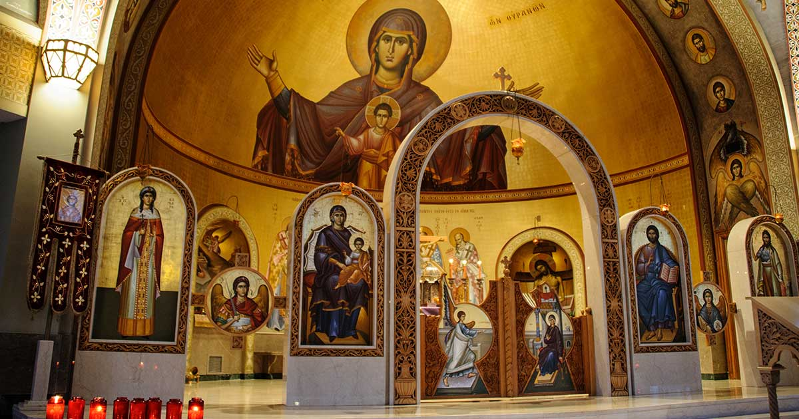
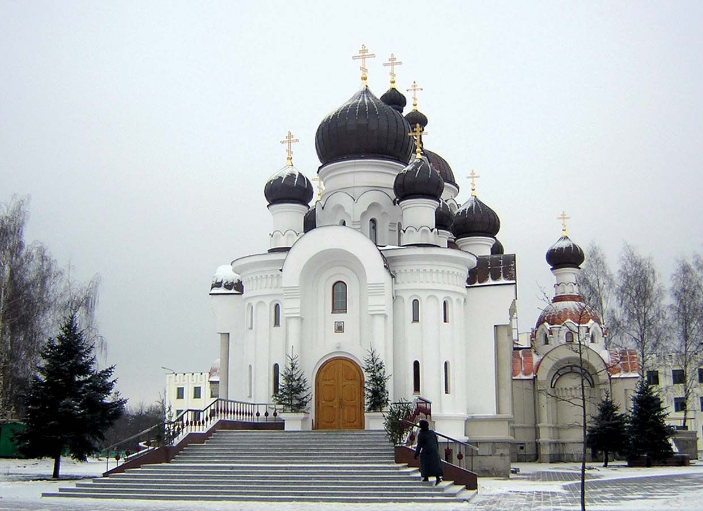
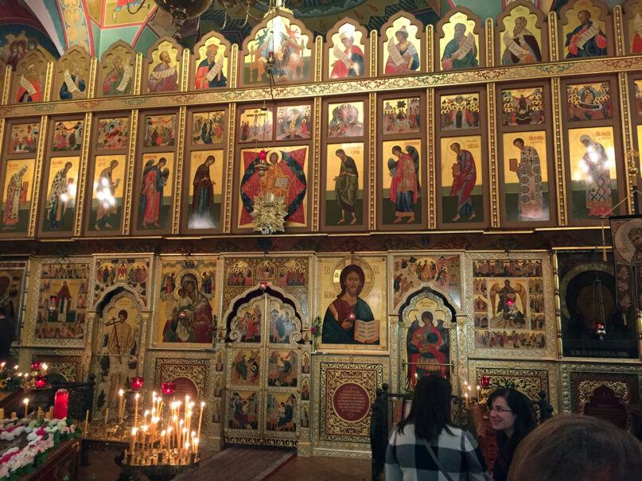

<!DOCTYPE html>
<html lang="en">
<head>
    <meta charset="UTF-8">
    <meta name="viewport" content="width=device-width, initial-scale=1.0">
    <title>Ethiopian Orthodox Tewahedo Church</title>
    
</head>
<body>

    <header>
        <h1>Ethiopian Orthodox Tewahedo Church</h1>
    </header>

    <nav>
        <a href="#about">About</a>
        <a href="#liturgy">Liturgy</a>
        <a href="#scripture">Scripture</a>
        <a href="#art">Art & Architecture</a>
        <a href="#festivals">Festivals</a>
        <a href="#monasticism">Monasticism</a>
        <a href="#global">Global Presence</a>
        <a href="#resources">Resources</a>
        <a href="#news">News</a>
        <a href="#contact">Contact</a>
    </nav>

    

        <section id="about" class="section">
            <h2>About the Ethiopian Orthodox Tewahedo Church</h2>
            
The Ethiopian Orthodox Tewahedo Church is one of the oldest Christian churches in the world. It has a rich history and unique traditions that have been preserved for centuries.

        </section>

        <section id="liturgy" class="section">
            <h2>Liturgy and Worship</h2>
            
The liturgy of the EOTC is deeply spiritual and involves various sacraments, prayers, and hymns that are central to the faith.

        </section>

        <section id="scripture" class="section">
            <h2>Scripture and Teachings</h2>
            
The EOTC follows a unique canon of the Bible, which includes 81 books. The teachings of the church are rooted in both scripture and tradition.

        </section>

        <section id="art" class="section">
            <h2>Art and Architecture</h2>
            
Ethiopian church architecture and religious art are renowned for their beauty and symbolism. The churches of Lalibela are a prime example.

        </section>

        <section id="festivals" class="section">
            <h2>Festivals and Traditions</h2>
            
The EOTC celebrates numerous festivals throughout the year, each with its own unique traditions and significance.

        </section>

        <section id="monasticism" class="section">
            <h2>Monasticism</h2>
            
Monasticism plays a vital role in the EOTC, with many monasteries serving as centers of spiritual life and learning.

        </section>

        <section id="global" class="section">
            <h2>Global Presence</h2>
            
The EOTC has a growing presence around the world, with diaspora communities establishing churches in many countries.

        </section>

        <section id="resources" class="section">
            <h2>Resources</h2>
            
Find books, videos, and other resources to learn more about the Ethiopian Orthodox Tewahedo Church.

        </section>

        <section id="news" class="section">
            <h2>News and Events</h2>
            
Stay updated with the latest news and events from the EOTC.

        </section>

        <section id="contact" class="section">
            <h2>Contact and Community</h2>
            
Get in touch with the church and join the online community.

        </section>

        <section id="gallery" class="section">
            <h2>Multimedia Gallery</h2>
            

                
                
                
     
            

        </section>
    

    <footer>
        
&copy; 2023 Ethiopian Orthodox Tewahedo Church. All rights reserved.

    </footer>

    

</body>
</html>
